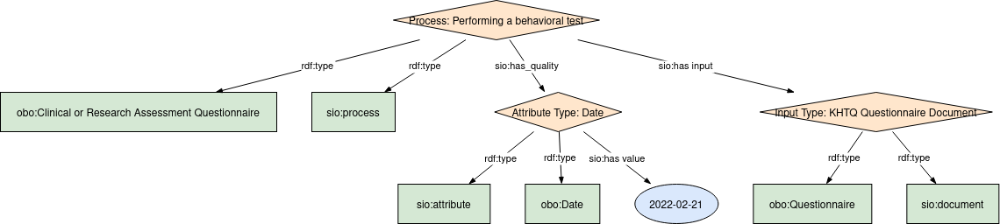
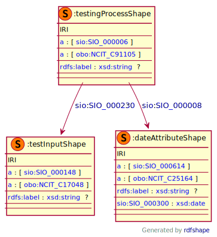

## Date

### Semantic model figure
This module describes the data elements in the KHTQ. It specifically covers the data element in the table _Date_. This module is based on the [EJP RD CDE core semantic model](https://github.com/ejp-rd-vp/CDE-semantic-model#cde-modules-overview), which in turn is based on the [SIO ontology design pattern for measurements](https://github.com/MaastrichtU-IDS/semanticscience/wiki/DP-Measurements).
<p align="center">
    <a href="../images/rdf/date.png" target="_blank">
        
    </a>
</p>

***

### Example RDF (turtle)
```ttl
@prefix : <http://w3id.org/bind/data/v1/example-rdf/> .
@prefix obo: <http://purl.obolibrary.org/obo/> .
@prefix sio: <http://semanticscience.org/resource/> .
@prefix xsd: <http://www.w3.org/2001/XMLSchema#> .
@prefix rdfs: <http://www.w3.org/2000/01/rdf-schema#> .

:testing_process_ a obo:NCIT_C91105, sio:SIO_000006 ;
    rdfs:label "Process: Performing a behavioral test"^^xsd:string ;
    sio:SIO_000230 :test_input_ ;
    sio:SIO_000008 :date_attribute_ .

:test_input_ a obo:NCIT_C17048, sio:SIO_000148 ;
    rdfs:label "Input Type: KHTQ Questionnaire Document"^^xsd:string .   

:date_attribute_ a obo:NCIT_C25164, sio:SIO_000614 ;
    rdfs:label "Attribute Type: Date" ;
    sio:SIO_000300 "2022-02-21"^^xsd:date .
```

***
### Validation artifacts
##### ShEx figure
<p align="center">
    <a href="../images/shex/date.svg" target="_blank">
        
    </a>
</p>

***
##### ShEx
``` ShEx
PREFIX : <http://w3id.org/bind/data/v1/shex/>
PREFIX obo: <http://purl.obolibrary.org/obo/> 
PREFIX sio: <http://semanticscience.org/resource/>
PREFIX xsd: <http://www.w3.org/2001/XMLSchema#>
PREFIX rdfs: <http://www.w3.org/2000/01/rdf-schema#>

:testingProcessShape IRI { 
    a [sio:SIO_000006] ;
    a [obo:NCIT_C91105] ;
    rdfs:label xsd:string? ;
    sio:SIO_000230 @:testInputShape ;
    sio:SIO_000008 @:dateAttributeShape
}

:testInputShape IRI {
    a [sio:SIO_000148] ;
    a [obo:NCIT_C17048] ;
    rdfs:label xsd:string? 
}

:dateAttributeShape IRI {
    a [sio:SIO_000614] ;
    a [obo:NCIT_C25164] ;
    rdfs:label xsd:string? ;
    sio:SIO_000300 xsd:date
}
```
