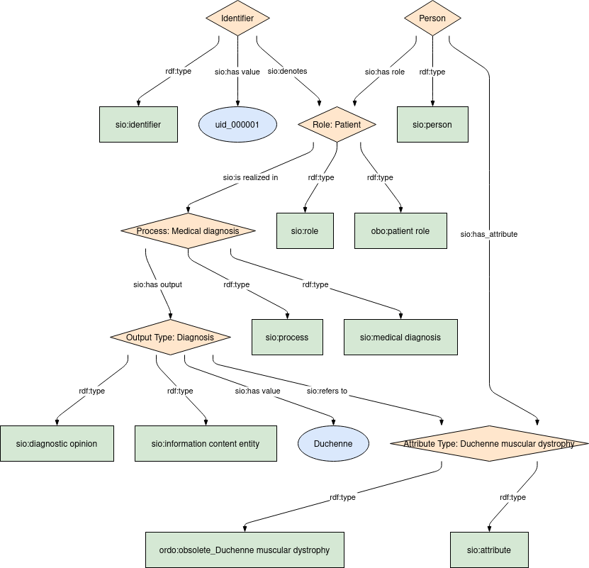
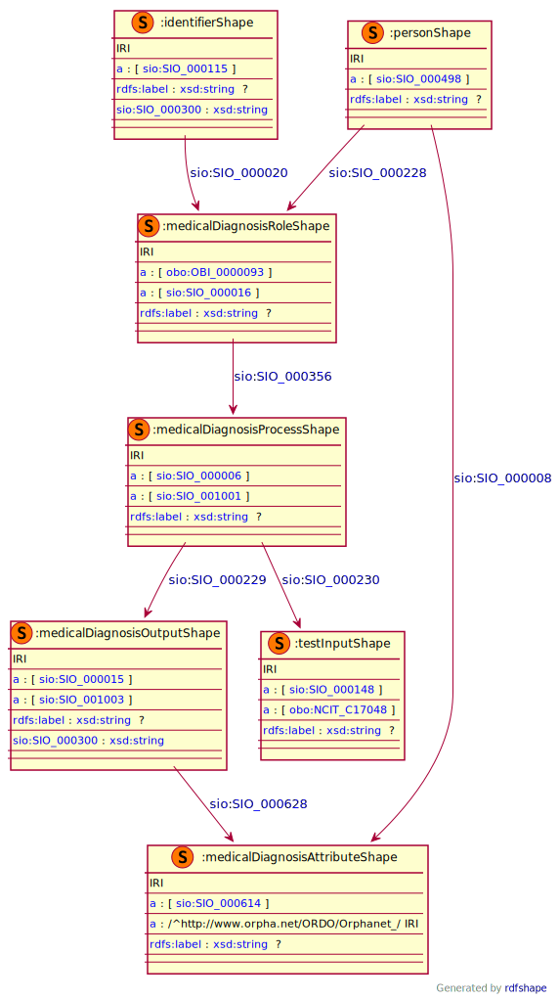

## Diagnosis

### Semantic model figure
This module describes the data elements in the KHTQ. It specifically covers the data element in the table _Diagnosis_. This module is based on the EJP RD CDE semantic model module for _Disease diagnosis_ group [CDE-semantic-model/disease diagnosis](https://github.com/ejp-rd-vp/CDE-semantic-model/blob/master/docs/disease_diagnosis.md).
<p align="center">
    <a href="../images/rdf/diagnosis.png" target="_blank">
        
    </a>
</p>

***

### Example RDF (turtle)
```ttl
@prefix : <http://w3id.org/bind/data/v1/example-rdf/> .
@prefix obo: <http://purl.obolibrary.org/obo/> .
@prefix sio: <http://semanticscience.org/resource/> .
@prefix xsd: <http://www.w3.org/2001/XMLSchema#> .
@prefix rdfs: <http://www.w3.org/2000/01/rdf-schema#> .

:identifier_ a sio:SIO_000115 ;
    rdfs:label "Identifier"^^xsd:string ;
    sio:SIO_000020 :diagnosis_role_ ;
    sio:SIO_000300 "uid_000001"^^xsd:string .

:person_ a sio:SIO_000498 ;
    rdfs:label "Person"^^xsd:string ;
    sio:SIO_000228 :diagnosis_role_ ;
    sio:SIO_000008 :diagnosis_attribute_ .

:diagnosis_role_ a obo:OBI_0000093, sio:SIO_000016 ;
    rdfs:label "Role: Patient"^^xsd:string ;
    sio:SIO_000356 :diagnosis_process_ .

:diagnosis_process_ a sio:SIO_000006, sio:SIO_001001 ;
    rdfs:label "Process: Medical diagnosis"^^xsd:string ;
    sio:SIO_000230 :test_input_ ;
    sio:SIO_000229 :diagnosis_output_ .

:diagnosis_output_ a sio:SIO_000015, sio:SIO_001003 ;
    rdfs:label "Output Type: Diagnosis"^^xsd:string ;
    sio:SIO_000300 "Duchenne"^^xsd:string ;
    sio:SIO_000628 :diagnosis_attribute_ .

:diagnosis_attribute_ a sio:SIO_000614, <http://www.orpha.net/ORDO/Orphanet_98896> ;
    rdfs:label "Attribute Type: Duchenne muscular dystrophy"^^xsd:string .

:test_input_ a obo:NCIT_C17048, sio:SIO_000148 ;
    rdfs:label "Input Type: KHTQ Questionnaire Document"^^xsd:string .
```

***
### Validation artifacts
##### ShEx figure
<p align="center">
    <a href="../images/shex/diagnosis.svg" target="_blank">
        
    </a>
</p>

***
##### ShEx
``` ShEx
PREFIX : <http://w3id.org/bind/data/v1/shex/>
PREFIX obo: <http://purl.obolibrary.org/obo/> 
PREFIX sio: <http://semanticscience.org/resource/>
PREFIX xsd: <http://www.w3.org/2001/XMLSchema#>
PREFIX rdfs: <http://www.w3.org/2000/01/rdf-schema#>

:identifierShape IRI {
    a [sio:SIO_000115] ;
    rdfs:label xsd:string? ;
    sio:SIO_000020 @:medicalDiagnosisRoleShape ;
    sio:SIO_000300 xsd:string
}

:personShape IRI { 
    a [sio:SIO_000498] ;
    rdfs:label xsd:string? ;
    sio:SIO_000228 @:medicalDiagnosisRoleShape ;
    sio:SIO_000008 @:medicalDiagnosisAttributeShape
}

:medicalDiagnosisRoleShape IRI {
    a [obo:OBI_0000093] ;
    a [sio:SIO_000016] ;
    rdfs:label xsd:string? ;
    sio:SIO_000356 @:medicalDiagnosisProcessShape
}

:medicalDiagnosisProcessShape IRI {
    a [sio:SIO_000006] ;
    a [sio:SIO_001001] ;
    rdfs:label xsd:string? ;
    sio:SIO_000230 @:testInputShape ;
    sio:SIO_000229 @:medicalDiagnosisOutputShape
}

:medicalDiagnosisOutputShape IRI {
    a [sio:SIO_000015] ;
    a [sio:SIO_001003] ;
    rdfs:label xsd:string? ;
    sio:SIO_000300 xsd:string ;
    sio:SIO_000628 @:medicalDiagnosisAttributeShape
}

:medicalDiagnosisAttributeShape IRI {
    a [sio:SIO_000614] ;
    a IRI /^http:\/\/www.orpha.net\/ORDO\/Orphanet_/ ;
    rdfs:label xsd:string?
}

:testInputShape IRI {
    a [sio:SIO_000148];
    a [obo:NCIT_C17048] ;
    rdfs:label xsd:string?
}
```
