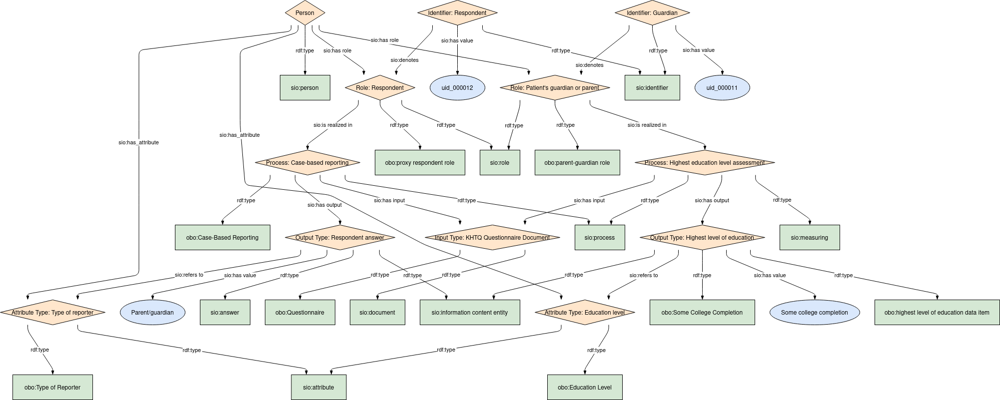

## Highest education level parent/guardian

### Semantic model figure
This module describes the data elements in the KHTQ. It specifically covers the data elements in the table _Highest education level parent/guardian_ and _Highest education level of other parent/guardian_. This module is based on the EJP RD CDE semantic model module for _Personal Information_ group [CDE-semantic-model/personal information](https://github.com/ejp-rd-vp/CDE-semantic-model/blob/980b1125222f1654c03da605835cbfd987d7970e/docs/personal_information.md).
<p align="center">
    <a href="../images/rdf/2_Personal_information.png" target="_blank">
        
    </a>
</p>

***

### Example RDF (turtle)
```ttl
@prefix : <http://w3id.org/bind/data/v1/example-rdf/> .
@prefix obo: <http://purl.obolibrary.org/obo/> .
@prefix sio: <http://semanticscience.org/resource/> .
@prefix xsd: <http://www.w3.org/2001/XMLSchema#> .
@prefix rdfs: <http://www.w3.org/2000/01/rdf-schema#> .

:identifier_ a sio:SIO_000115 ;
    rdfs:label "Identifier: Guardian"^^xsd:string ;
    sio:SIO_000020 :guardian_role_ ;
    sio:SIO_000300 "uid_000011"^^xsd:string .
        
:person_ a sio:SIO_000498 ;
    rdfs:label "Person"^^xsd:string ;
    sio:SIO_000228 :guardian_role_, :guardian_respondent_role_ ;
    sio:SIO_000008 :guardian_education_attribute_, :guardian_respondent_attribute_ .
    
:guardian_role_ a obo:GENEPIO_0100269, sio:SIO_000016 ;
    rdfs:label "Role: Patient's guardian or parent"^^xsd:string ;
    sio:SIO_000356 :highest_education_process_ .

:highest_education_process_ a sio:SIO_001054, sio:SIO_000006 ;
    rdfs:label "Process: Highest education level assessment"^^xsd:string ;
    sio:SIO_000230 :test_input_ ;
    sio:SIO_000229 :highest_education_output_ .
    
:highest_education_output_ a obo:NCIT_C67137, obo:OMRSE_00002045, sio:SIO_000015 ;
    rdfs:label "Output Type: Highest level of education"^^xsd:string ;
    sio:SIO_000300 "Some college completion"^^xsd:string ;
    sio:SIO_000628 :guardian_education_attribute_ .

:guardian_education_attribute_ a obo:NCIT_C17953, sio:SIO_000614 ;
    rdfs:label "Attribute Type: Education level"^^xsd:string .


# In the case the guardian is the respondent, then:

:guardian_respondent_identifier_ a sio:SIO_000115 ;
    rdfs:label "Identifier: Respondent"^^xsd:string ;
    sio:SIO_000020 :guardian_respondent_role_ ;
    sio:SIO_000300 "uid_000012"^^xsd:string .

:guardian_respondent_role_ a obo:OBI_0000211, sio:SIO_000016 ;
    rdfs:label "Role: Respondent"^^xsd:string ;
    sio:SIO_000356 :guardian_respondent_process_ .

:guardian_respondent_process_ a obo:NCIT_C173765, sio:SIO_000006 ;
    rdfs:label "Process: Case-based reporting"^^xsd:string ;
    sio:SIO_000230 :test_input_ ;
    sio:SIO_000229 :guardian_respondent_output_ .

:guardian_respondent_output_ a sio:SIO_000785, sio:SIO_000015 ;
    rdfs:label "Output Type: Respondent answer"^^xsd:string ;
    sio:SIO_000300 "Parent/guardian"^^xsd:string ;
    sio:SIO_000628 :guardian_respondent_attribute_ .

:guardian_respondent_attribute_ a obo:NCIT_C53615, sio:SIO_000614 ;
    rdfs:label "Attribute Type: Type of reporter"^^xsd:string .

:test_input_ a obo:NCIT_C17048, sio:SIO_000148 ;
    rdfs:label "Input Type: KHTQ Questionnaire Document"^^xsd:string .
```

***
### Validation artifacts
##### ShEx figure

<p align="center">
    <a href="../images/shex/2_Personal_information.svg" target="_blank">
        
    </a>
</p>

***
##### ShEx
``` ShEx

```
