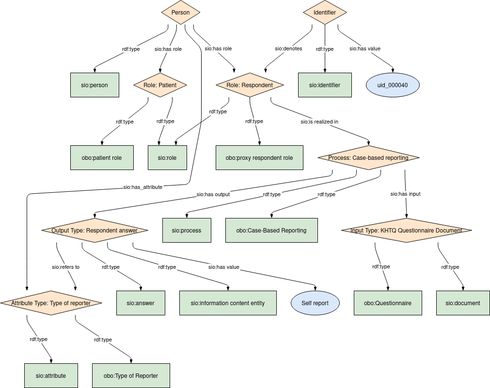

## Respondent

### Semantic model figure
This module describes the data elements in the KHTQ. It specifically covers the data element in the table _Respondent_. This module is based on the EJP RD CDE semantic model module for _Personal Information_ group [CDE-semantic-model/personal information](https://github.com/ejp-rd-vp/CDE-semantic-model/blob/980b1125222f1654c03da605835cbfd987d7970e/docs/personal_information.md).
<p align="center">
    <a href="../images/rdf/respondent.png" target="_blank">
        
    </a>
</p>

***

### Example RDF (turtle)
```ttl
@prefix : <http://w3id.org/bind/data/v1/example-rdf/> .
@prefix obo: <http://purl.obolibrary.org/obo/> .
@prefix sio: <http://semanticscience.org/resource/> .
@prefix xsd: <http://www.w3.org/2001/XMLSchema#> .
@prefix rdfs: <http://www.w3.org/2000/01/rdf-schema#> .

:identifier_ a sio:SIO_000115 ;
    rdfs:label "Identifier"^^xsd:string ;
    sio:SIO_000020 :respondent_role_ ;
    sio:SIO_000300 "uid_000040"^^xsd:string .

:person_ a sio:SIO_000498 ;
    rdfs:label "Person"^^xsd:string ;
    sio:SIO_000228 :patient_role_, :respondent_role_ ;
    sio:SIO_000008 :respondent_attribute_ .

:patient_role_ a obo:OBI_0000093, sio:SIO_000016 ;
    rdfs:label "Role: Patient"^^xsd:string .

:respondent_role_ a obo:OBI_0000211, sio:SIO_000016 ;
    rdfs:label "Role: Respondent"^^xsd:string ;
    sio:SIO_000356 :respondent_process_ .

:respondent_process_ a obo:NCIT_C173765, sio:SIO_000006 ;
    rdfs:label "Process: Case-based reporting"^^xsd:string ;
    sio:SIO_000230 :test_input_ ;
    sio:SIO_000229 :respondent_output_ .

:respondent_output_ a sio:SIO_000785, sio:SIO_000015 ;
    rdfs:label "Output Type: Respondent answer"^^xsd:string ;
    sio:SIO_000300 "Self report"^^xsd:string ;
    sio:SIO_000628 :respondent_attribute_ .

:respondent_attribute_ a obo:NCIT_C53615, sio:SIO_000614 ;
    rdfs:label "Attribute Type: Type of reporter"^^xsd:string .

:test_input_ a obo:NCIT_C17048, sio:SIO_000148 ;
    rdfs:label "Input Type: KHTQ Questionnaire Document"^^xsd:string .
```

***
### Validation artifacts
##### ShEx figure
<p align="center">
    <a href="../images/shex/respondent.svg" target="_blank">
        
    </a>
</p>

***
##### ShEx
``` ShEx
PREFIX : <http://w3id.org/bind/data/v1/shex/>
PREFIX obo: <http://purl.obolibrary.org/obo/>
PREFIX sio: <http://semanticscience.org/resource/>
PREFIX xsd: <http://www.w3.org/2001/XMLSchema#>
PREFIX rdfs: <http://www.w3.org/2000/01/rdf-schema#>

:identifierShape IRI {
    a [sio:SIO_000115] ;
    rdfs:label xsd:string? ;
    sio:SIO_000020 @:respondentRoleShape ;
    sio:SIO_000300 xsd:string
}

:personShape IRI { 
    a [sio:SIO_000498] ;
    rdfs:label xsd:string? ;
    sio:SIO_000228 @:patientRoleShape ;
    sio:SIO_000008 @:respondentAttributeShape
}

:respondentRoleShape IRI {
    a [sio:SIO_000016] ;
    a [obo:OBI_0000211] ;
    rdfs:label xsd:string? ;
    sio:SIO_000356 @:respondentProcessShape
}

:patientRoleShape IRI {
    a [sio:SIO_000016] ;
    a [obo:OBI_0000093] ;
    rdfs:label xsd:string? 
}

:respondentProcessShape IRI {
    a [sio:SIO_000006] ;
    a [obo:NCIT_C173765] ;
    rdfs:label xsd:string? ;
    sio:SIO_000230 @:testInputShape ;
    sio:SIO_000229 @:respondentOutputShape
}

:respondentOutputShape IRI {
    a [sio:SIO_000015] ;
    a [sio:SIO_000785] ;
    rdfs:label xsd:string? ;
    sio:SIO_000300 xsd:string ;
    sio:SIO_000628 @:respondentAttributeShape
}

:respondentAttributeShape IRI {
    a [sio:SIO_000614] ;
    a [obo:NCIT_C53615] ;
    rdfs:label xsd:string?
}

:testInputShape IRI {
    a [sio:SIO_000148];
    a [obo:NCIT_C17048] ;
    rdfs:label xsd:string?
}
```
