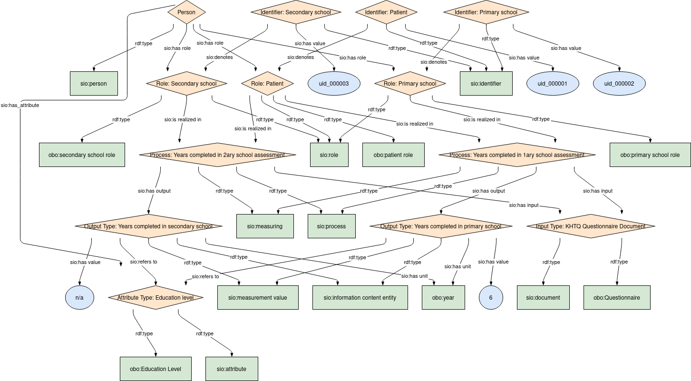

## Years completed

### Semantic model figure
This module describes the data elements in the KHTQ. It specifically covers the data elements in the table _Years completed in primary school_ and _Years completed in seconday school_. This module is based on the EJP RD CDE semantic model module for _Personal Information_ group [CDE-semantic-model/personal information](https://github.com/ejp-rd-vp/CDE-semantic-model/blob/980b1125222f1654c03da605835cbfd987d7970e/docs/personal_information.md).
<p align="center">
    <a href="../images/rdf/years_completed.png" target="_blank">
        
    </a>
</p>

***

### Example RDF (turtle)
```ttl
@prefix : <http://w3id.org/bind/data/v1/example-rdf/> .
@prefix obo: <http://purl.obolibrary.org/obo/> .
@prefix sio: <http://semanticscience.org/resource/> .
@prefix xsd: <http://www.w3.org/2001/XMLSchema#> .
@prefix rdfs: <http://www.w3.org/2000/01/rdf-schema#> .

:patient_identifier_ a sio:SIO_000115 ;
    rdfs:label "Identifier: Patient"^^xsd:string ;
    sio:SIO_000020 :patient_role_ ;
    sio:SIO_000300 "uid_000001"^^xsd:string .

:primary_school_identifier_ a sio:SIO_000115 ;
    rdfs:label "Identifier: Primary school"^^xsd:string ;
    sio:SIO_000020 :primary_school_role_ ;
    sio:SIO_000300 "uid_000002"^^xsd:string .

:secondary_school_identifier_ a sio:SIO_000115 ;
    rdfs:label "Identifier: Secondary school"^^xsd:string ;
    sio:SIO_000020 :secondary_school_role_ ;
    sio:SIO_000300 "uid_000003"^^xsd:string .

:person_ a sio:SIO_000498 ;
    rdfs:label "Person"^^xsd:string ;
    sio:SIO_000228 :patient_role_, :primary_school_role_, :secondary_school_role_ ;
    sio:SIO_000008 :education_attribute_ .

:patient_role_ a obo:OBI_0000093, sio:SIO_000016 ;
    rdfs:label "Role: Patient"^^xsd:string ;
    sio:SIO_000356 :primary_school_process_, :secondary_school_process_ .

:primary_school_role_ a obo:OMRSE_00000060, sio:SIO_000016 ;
    rdfs:label "Role: Primary school"^^xsd:string ;
    sio:SIO_000356 :primary_school_process_ .

:secondary_school_role_ a obo:OMRSE_00000065, sio:SIO_000016 ;
    rdfs:label "Role: Secondary school"^^xsd:string ;
    sio:SIO_000356 :secondary_school_process_ .

:primary_school_process_ a sio:SIO_001054, sio:SIO_000006 ;
    rdfs:label "Process: Years completed in 1ary school assessment"^^xsd:string ;
    sio:SIO_000230 :test_input_ ;
    sio:SIO_000229 :primary_school_output_ .

:secondary_school_process_ a sio:SIO_001054, sio:SIO_000006 ;
    rdfs:label "Process: Years completed in 2ary school assessment"^^xsd:string ;
    sio:SIO_000230 :test_input_ ;
    sio:SIO_000229 :secondary_school_output_ .

:primary_school_output_ a sio:SIO_000070, sio:SIO_000015 ;
    rdfs:label "Output Type: Years completed in primary school"^^xsd:string ;
    sio:SIO_000300 "6"^^xsd:string ;
    sio:SIO_000221 obo:UO_0000036 ;
    sio:SIO_000628 :education_attribute_ .

:secondary_school_output_ a sio:SIO_000070, sio:SIO_000015 ;
    rdfs:label "Output Type: Years completed in secondary school"^^xsd:string ;
    sio:SIO_000300 "n/a"^^xsd:string ;
    sio:SIO_000221 obo:UO_0000036 ;
    sio:SIO_000628 :education_attribute_ .

:education_attribute_ a obo:NCIT_C17953, sio:SIO_000614 ;
    rdfs:label "Attribute Type: Education level"^^xsd:string .

:test_input_ a obo:NCIT_C17048, sio:SIO_000148 ;
    rdfs:label "Input Type: KHTQ Questionnaire Document"^^xsd:string .
```

***
### Validation artifacts
##### ShEx figure
<p align="center">
    <a href="../images/shex/years_completed.svg" target="_blank">
        
    </a>
</p>

***

##### ShEx
``` ShEx
PREFIX : <http://w3id.org/bind/data/v1/shex/>
PREFIX obo: <http://purl.obolibrary.org/obo/> 
PREFIX sio: <http://semanticscience.org/resource/>
PREFIX xsd: <http://www.w3.org/2001/XMLSchema#>
PREFIX rdfs: <http://www.w3.org/2000/01/rdf-schema#>

:patientIdentifierShape IRI {
    a [sio:SIO_000115] ;
    rdfs:label xsd:string? ;
    sio:SIO_000020 @:patientRoleShape ;
    sio:SIO_000300 xsd:string
}

:primarySchoolIdentifierShape IRI {
    a [sio:SIO_000115] ;
    rdfs:label xsd:string? ;
    sio:SIO_000020 @:primarySchoolRoleShape ;
    sio:SIO_000300 xsd:string
}

:secondarySchoolIdentifierShape IRI {
    a [sio:SIO_000115] ;
    rdfs:label xsd:string? ;
    sio:SIO_000020 @:secondarySchoolRoleShape ;
    sio:SIO_000300 xsd:string
}

:personShape IRI { 
    a [sio:SIO_000498] ;
    rdfs:label xsd:string? ;
    sio:SIO_000228 @:patientRoleShape ;
    sio:SIO_000228 @:primarySchoolRoleShape ; 
    sio:SIO_000228 @:secondarySchoolRoleShape ;
    sio:SIO_000008 @:educationAttributeShape
}

:patientRoleShape IRI {
    a [sio:SIO_000016] ;
    a [obo:OBI_0000093] ;
    rdfs:label xsd:string? ;
    sio:SIO_000356 @:primarySchoolProcessShape ;
    sio:SIO_000356 @:secondarySchoolProcessShape
}

:primarySchoolRoleShape IRI {
    a [sio:SIO_000016] ;
    a [obo:OMRSE_00000060] ;
    rdfs:label xsd:string? ;
    sio:SIO_000356 @:primarySchoolProcessShape 
}

:secondarySchoolRoleShape IRI {
    a [sio:SIO_000016] ;
    a [obo:OMRSE_00000065] ;
    rdfs:label xsd:string? ;
    sio:SIO_000356 @:secondarySchoolProcessShape
}

:primarySchoolProcessShape IRI {
    a [sio:SIO_000006] ;
    a [sio:SIO_001054] ;
    rdfs:label xsd:string? ;
    sio:SIO_000230 @:testInputShape ;
    sio:SIO_000229 @:primarySchoolOutputShape
}

:secondarySchoolProcessShape IRI {
    a [sio:SIO_000006] ;
    a [sio:SIO_001054] ;
    rdfs:label xsd:string? ;
    sio:SIO_000230 @:testInputShape ;
    sio:SIO_000229 @:secondarySchoolOutputShape
}

:primarySchoolOutputShape IRI {
    a [sio:SIO_000015] ;
    a [sio:SIO_000070] ;
    rdfs:label xsd:string? ;
    sio:SIO_000300 xsd:string ;
    sio:SIO_000221 [obo:UO_0000036] ;
    sio:SIO_000628 @:educationAttributeShape
}

:secondarySchoolOutputShape IRI {
    a [sio:SIO_000015] ;
    a [sio:SIO_000070] ;
    rdfs:label xsd:string? ;
    sio:SIO_000300 xsd:string ;
    sio:SIO_000221 [obo:UO_0000036] ;
    sio:SIO_000628 @:educationAttributeShape
}

:educationAttributeShape IRI {
    a [sio:SIO_000614] ;
    a [obo:NCIT_C17953] ;
    rdfs:label xsd:string?
}

:testInputShape IRI {
    a [sio:SIO_000148];
    a [obo:NCIT_C17048] ;
    rdfs:label xsd:string?
}
```
