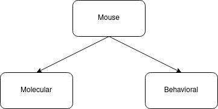

# Semantic model for WP4 therapeutic outcome data FAIRification

In this directory there is the semantic model to represent WP4 outcome data for FAIRification at data level. The model is composed of three different modules ([mouse](https://github.com/NuriaQueralt/bind-data-semantic-model/blob/main/therapeutic-wp4/docs/mouse_outcome.md), [molecular](https://github.com/NuriaQueralt/bind-data-semantic-model/blob/main/therapeutic-wp4/docs/molecular_outcome.md), and [behavioral](https://github.com/NuriaQueralt/bind-data-semantic-model/blob/main/therapeutic-wp4/docs/behavioral_outcome.md)) that are linked in the following way (abstract visualization of the semantic modules):

    

