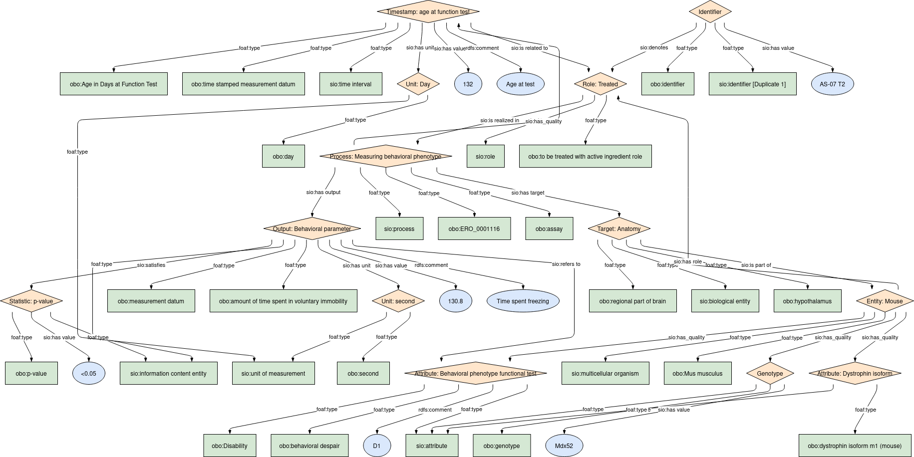
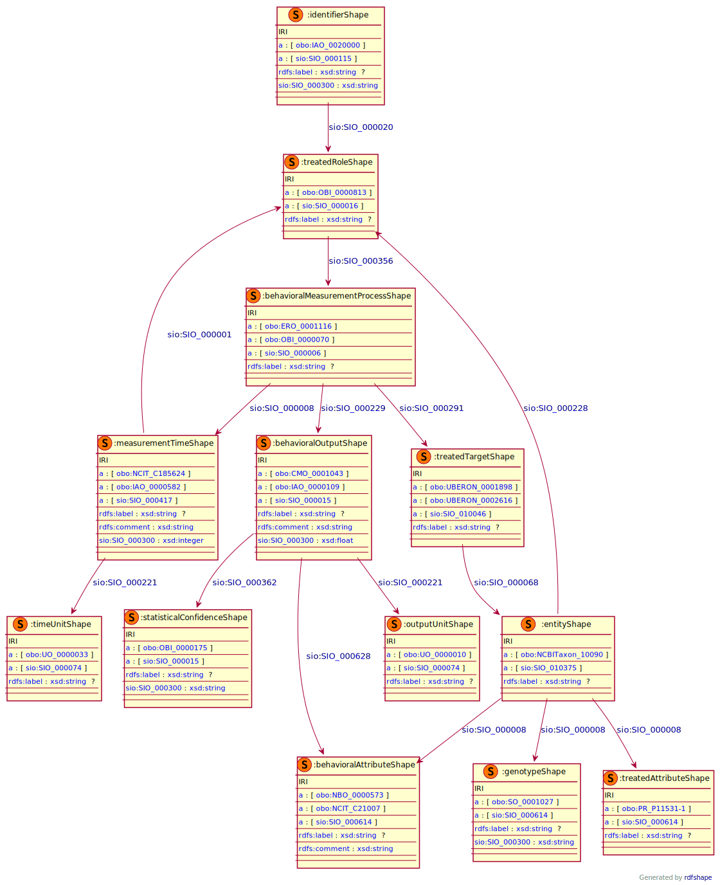

## Behavioral outcome

### Semantic model figure
This module describes the __behavioral__ data elements for therapeutic outcome. It specifically covers the data elements in the table that refer to the _behavioral parameters_. This module is based on the EJP RD CDE semantic model module for _DCDE Laboratory measurement_ group [CDE-semantic-model/DCDE_Laboratory_measurement](https://github.com/ejp-rd-vp/CDE-semantic-model/blob/develop/docs/DCDE_lab_measurement.md) and on the EJP RD CDE semantic module for _Disability_ [CDE-semantic-model/Disability](https://github.com/ejp-rd-vp/CDE-semantic-model/blob/develop/docs/8.Disability.md).
<p align="center">
    <a href="../images/rdf/behavioral_outcome.png" target="_blank">
        
    </a>
</p>

***

### Example RDF (turtle)
```ttl
@prefix : <http://w3id.org/bind/data/v1/example-rdf/> .
@prefix obo: <http://purl.obolibrary.org/obo/> .
@prefix sio: <http://semanticscience.org/resource/> .
@prefix xsd: <http://www.w3.org/2001/XMLSchema#> .
@prefix rdfs: <http://www.w3.org/2000/01/rdf-schema#> .

:identifier_ a obo:IAO_0020000, sio:SIO_000115 ;
    rdfs:label "Identifier"^^xsd:string ;
    sio:SIO_000300 "AS-07 T2"^^xsd:string ;
    sio:SIO_000020 :treated_role_ .

:entity_ a obo:NCBITaxon_10090, sio:SIO_010375 ;
    rdfs:label "Entity: Mouse"^^xsd:string ;
    sio:SIO_000228 :treated_role_ ;
    sio:SIO_000008 :treated_attribute_ ;
    sio:SIO_000008 :genotype_ ;
    sio:SIO_000008 :behavioral_attribute_ .

:genotype_ a obo:SO_0001027, sio:SIO_000614 ;
    rdfs:label "Genotype"^^xsd:string ;
    sio:SIO_000300 "Mdx52"^^xsd:string .

:treated_role_ a obo:OBI_0000813, sio:SIO_000016 ;
    rdfs:label "Role: Treated"^^xsd:string ;
    sio:SIO_000356 :behavioral_measurement_process_ .

:behavioral_measurement_process_ a obo:ERO_0001116, obo:OBI_0000070, sio:SIO_000006 ;
    rdfs:label "Process: Measuring behavioral phenotype"^^xsd:string ;
    sio:SIO_000291 :treated_target_ ;
    sio:SIO_000229 :behavioral_output_ ;
    sio:SIO_000008 :measurement_time_ .

:treated_target_ a obo:UBERON_0001898, obo:UBERON_0002616, sio:SIO_010046 ;
    rdfs:label "Target: Anatomy"^^xsd:string ;
    sio:SIO_000068 :entity_ .

:behavioral_output_ a obo:CMO_0001043, obo:IAO_0000109, sio:SIO_000015 ;
    rdfs:label "Output: Behavioral parameter"^^xsd:string ;
    rdfs:comment "Time spent freezing"^^xsd:string ;
    sio:SIO_000300 "130.8"^^xsd:float ;
    sio:SIO_000221 :output_unit_ ;
    sio:SIO_000362 :statistical_confidence_ ; # satisfies p-value (I think this should be in EBRAINS metadata) Necessary at level of data?
    sio:SIO_000628 :behavioral_attribute_ .

:measurement_time_ a obo:NCIT_C185624, obo:IAO_0000582, sio:SIO_000417 ;
    rdfs:label "Timestamp: age at function test"^^xsd:string ;
    rdfs:comment "Age at test"^^xsd:string ;
    sio:SIO_000300 "132"^^xsd:integer ;
    sio:SIO_000221 :time_unit_ ;
    sio:SIO_000001 :treated_role_ .

:output_unit_ a obo:UO_0000010, sio:SIO_000074 ;
    rdfs:label "Unit: second"^^xsd:string .

:treated_attribute_ a obo:PR_P11531-1, sio:SIO_000614 ;
    rdfs:label "Attribute: Dystrophin isoform"^^xsd:string .

:behavioral_attribute_ a obo:NBO_0000573 ,obo:NCIT_C21007 , sio:SIO_000614 ;
    rdfs:label "Attribute: Behavioral phenotype functional test"^^xsd:string ;
    rdfs:comment "D1"^^xsd:string .

:time_unit_ a obo:UO_0000033, sio:SIO_000074 ;
    rdfs:label "Unit: Day"^^xsd:string .

:statistical_confidence_ a obo:OBI_0000175, sio:SIO_000015 ;
    rdfs:label "Statistic: p-value"^^xsd:string ;
    sio:SIO_000300 "<0.05"^^xsd:string .
```

***
### Validation artifacts
##### ShEx figure
<p align="center">
    <a href="../images/shex/behavioral_outcome.svg" target="_blank">
        
    </a>
</p>

***
##### ShEx
``` ShEx
PREFIX : <http://w3id.org/bind/data/v1/shex/>
PREFIX obo: <http://purl.obolibrary.org/obo/>
PREFIX sio: <http://semanticscience.org/resource/>
PREFIX xsd: <http://www.w3.org/2001/XMLSchema#>
PREFIX rdfs: <http://www.w3.org/2000/01/rdf-schema#>

:identifierShape IRI {
    a [obo:IAO_0020000] ;
    a [sio:SIO_000115] ;
    rdfs:label xsd:string? ;
    sio:SIO_000300 xsd:string ;
    sio:SIO_000020 @:treatedRoleShape
}

:entityShape IRI {
    a [obo:NCBITaxon_10090] ;
    a [sio:SIO_010375] ;
    rdfs:label xsd:string? ;
    sio:SIO_000228 @:treatedRoleShape ;
    sio:SIO_000008 @:genotypeShape ;
    sio:SIO_000008 @:behavioralAttributeShape ;
    sio:SIO_000008 @:treatedAttributeShape
}

:genotypeShape IRI {
    a [obo:SO_0001027] ;
    a [sio:SIO_000614] ;
    rdfs:label xsd:string? ;
    sio:SIO_000300 xsd:string
}

:treatedRoleShape IRI {
    a [obo:OBI_0000813] ;
    a [sio:SIO_000016] ;
    rdfs:label xsd:string? ;
    sio:SIO_000356 @:behavioralMeasurementProcessShape
}

:behavioralMeasurementProcessShape IRI {
    a [obo:ERO_0001116] ;
    a [obo:OBI_0000070] ;
    a [sio:SIO_000006] ;
    rdfs:label xsd:string? ;
    sio:SIO_000291 @:treatedTargetShape ;
    sio:SIO_000229 @:behavioralOutputShape ;
    sio:SIO_000008 @:measurementTimeShape
}

:treatedTargetShape IRI {
    a [obo:UBERON_0001898] ;
    a [obo:UBERON_0002616] ;
    a [sio:SIO_010046] ;
    rdfs:label xsd:string? ;
    sio:SIO_000068 @:entityShape
}

:behavioralOutputShape IRI {
    a [obo:CMO_0001043] ;
    a [obo:IAO_0000109] ;
    a [sio:SIO_000015] ;
    rdfs:label xsd:string? ;
    rdfs:comment xsd:string ;
    sio:SIO_000300 xsd:float ;
    sio:SIO_000221 @:outputUnitShape ;
    sio:SIO_000362 @:statisticalConfidenceShape ;
    sio:SIO_000628 @:behavioralAttributeShape
}

:measurementTimeShape IRI {
    a [obo:NCIT_C185624] ;
    a [obo:IAO_0000582] ;
    a [sio:SIO_000417] ;
    rdfs:label xsd:string? ;
    rdfs:comment xsd:string ;
    sio:SIO_000300 xsd:integer ;
    sio:SIO_000221 @:timeUnitShape ;
    sio:SIO_000001 @:treatedRoleShape
}

:outputUnitShape IRI {
    a [obo:UO_0000010] ;
    a [sio:SIO_000074] ;
    rdfs:label xsd:string?
}

:treatedAttributeShape IRI {
    a [obo:PR_P11531-1] ;
    a [sio:SIO_000614] ;
    rdfs:label xsd:string?
}

:behavioralAttributeShape IRI {
    a [obo:NBO_0000573] ;
    a [obo:NCIT_C21007] ;
    a [sio:SIO_000614] ;
    rdfs:label xsd:string? ;
    rdfs:comment xsd:string
}

:timeUnitShape IRI {
    a [obo:UO_0000033] ;
    a [sio:SIO_000074] ;
    rdfs:label xsd:string?
}

:statisticalConfidenceShape IRI {
    a [obo:OBI_0000175] ;
    a [sio:SIO_000015] ;
    rdfs:label xsd:string? ;
    sio:SIO_000300 xsd:string
}
```
