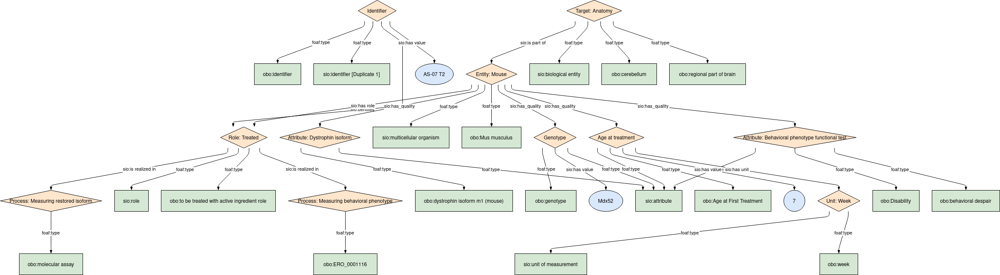

## Mouse outcome

### Semantic model figure
This module describes the __mouse__ data elements for therapeutic outcome. It specifically covers the data elements in the table that are related to the _mouse_ entity such as _identifier_. This module is based on the [EJP RD CDE semantic model](https://github.com/ejp-rd-vp/CDE-semantic-model/tree/develop) and is the link to the two components of the WP4 outcome semantic data model: [molecular](https://github.com/NuriaQueralt/bind-data-semantic-model/blob/main/therapeutic-wp4/docs/molecular_outcome.md) and [behavioral](https://github.com/NuriaQueralt/bind-data-semantic-model/blob/main/therapeutic-wp4/docs/behavioral_outcome.md) modules.  
<p align="center">
    <a href="../images/rdf/mouse_outcome.png" target="_blank">
        
    </a>
</p>

***

### Example RDF (turtle)
```ttl
@prefix : <http://w3id.org/bind/data/v1/example-rdf/> .
@prefix obo: <http://purl.obolibrary.org/obo/> .
@prefix sio: <http://semanticscience.org/resource/> .
@prefix xsd: <http://www.w3.org/2001/XMLSchema#> .
@prefix rdfs: <http://www.w3.org/2000/01/rdf-schema#> .

:identifier_ a obo:IAO_0020000, sio:SIO_000115 ;
    rdfs:label "Identifier"^^xsd:string ;
    sio:SIO_000300 "AS-07 T2"^^xsd:string ;
    sio:SIO_000020 :treated_role_ .

:entity_ a obo:NCBITaxon_10090, sio:SIO_010375 ;
    rdfs:label "Entity: Mouse"^^xsd:string ;
    sio:SIO_000228 :treated_role_ ;
    sio:SIO_000008 :treated_age_ ;
    sio:SIO_000008 :genotype_ ;
    sio:SIO_000008 :behavioral_attribute_ ;
    sio:SIO_000008 :treated_attribute_ .

:treated_role_ a obo:OBI_0000813, sio:SIO_000016 ;
    rdfs:label "Role: Treated"^^xsd:string ;
    sio:SIO_000356 :behavioral_measurement_process_ ;
    sio:SIO_000356 :restoration_measurement_process_ .

:behavioral_measurement_process_ a obo:ERO_0001116 ;
    rdfs:label "Process: Measuring behavioral phenotype"^^xsd:string .

:restoration_measurement_process_ a obo:ERO_0000833 ;
    rdfs:label "Process: Measuring restored isoform"^^xsd:string .

:treated_age_ a obo:NCIT_C124440, sio:SIO_000614 ;
    rdfs:label "Age at treatment"^^xsd:string ;
    sio:SIO_000300 "7"^^xsd:integer ;
    sio:SIO_000221 :treated_age_unit_ .

:treated_age_unit_ a obo:UO_0000034, sio:SIO_000074 ;
    rdfs:label "Unit: Week"^^xsd:string .

:genotype_ a obo:SO_0001027, sio:SIO_000614 ;
    rdfs:label "Genotype"^^xsd:string ;
    sio:SIO_000300 "Mdx52"^^xsd:string .

:treated_target_ a obo:UBERON_0002037, obo:UBERON_0002616, sio:SIO_010046 ;
    rdfs:label "Target: Anatomy"^^xsd:string ;
    sio:SIO_000068 :entity_ .

:treated_attribute_ a obo:PR_P11531-1, sio:SIO_000614 ;
    rdfs:label "Attribute: Dystrophin isoform"^^xsd:string .

:behavioral_attribute_ a obo:NBO_0000573 ,obo:NCIT_C21007 , sio:SIO_000614 ;
    rdfs:label "Attribute: Behavioral phenotype functional test"^^xsd:string .
```

***
### Validation artifacts
##### ShEx figure
<p align="center">
    <a href="../images/shex/mouse_outcome.svg" target="_blank">
        
    </a>
</p>

***
##### ShEx
``` ShEx
PREFIX : <http://w3id.org/bind/data/v1/shex/>
PREFIX obo: <http://purl.obolibrary.org/obo/>
PREFIX sio: <http://semanticscience.org/resource/>
PREFIX xsd: <http://www.w3.org/2001/XMLSchema#>
PREFIX rdfs: <http://www.w3.org/2000/01/rdf-schema#>

:identifierShape IRI {
    a [obo:IAO_0020000] ;
    a [sio:SIO_000115] ;
    rdfs:label xsd:string? ;
    sio:SIO_000300 xsd:string ;
    sio:SIO_000020 @:treatedRoleShape
}

:entityShape IRI {
    a [obo:NCBITaxon_10090] ;
    a [sio:SIO_010375] ;
    rdfs:label xsd:string? ;
    sio:SIO_000228 @:treatedRoleShape ;
    sio:SIO_000008 @:treatedAgeShape ;
    sio:SIO_000008 @:genotypeShape ;
    sio:SIO_000008 @:behavioralAttributeShape ;
    sio:SIO_000008 @:treatedAttributeShape
}

:treatedRoleShape IRI {
    a [obo:OBI_0000813] ;
    a [sio:SIO_000016] ;
    rdfs:label xsd:string? ;
    sio:SIO_000356 @:behavioralMeasurementProcessShape ;
    sio:SIO_000356 @:restorationMeasurementProcessShape
}

:behavioralMeasurementProcessShape IRI {
    a [obo:ERO_0001116] ;
    rdfs:label xsd:string?
}

:restorationMeasurementProcessShape IRI {
    a [obo:ERO_0000833] ;
    rdfs:label xsd:string? ;
}

:treatedAgeShape IRI {
    a [obo:NCIT_C124440] ;
    a [sio:SIO_000614] ;
    rdfs:label xsd:string? ;
    sio:SIO_000300 xsd:integer ;
    sio:SIO_000221 @:treatedAgeUnitShape
}

:treatedAgeUnitShape IRI {
    a [obo:UO_0000034] ;
    a [sio:SIO_000074] ;
    rdfs:label xsd:string?
}

:genotypeShape IRI {
    a [obo:SO_0001027] ;
    a [sio:SIO_000614] ;
    rdfs:label xsd:string? ;
    sio:SIO_000300 xsd:string
}

:treatedTargetShape IRI {
    a [obo:UBERON_0002616] ;
    a [sio:SIO_010046] ;
    rdfs:label xsd:string? ;
    sio:SIO_000068 @:entityShape
}

:treatedAttributeShape IRI {
    a [obo:PR_P11531-1] ;
    a [sio:SIO_000614] ;
    rdfs:label xsd:string?
}

:behavioralAttributeShape IRI {
    a [obo:NBO_0000573] ;
    a [obo:NCIT_C21007] ;
    a [sio:SIO_000614] ;
    rdfs:label xsd:string?
}
```
